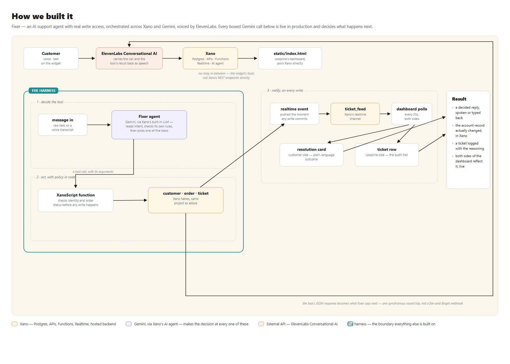

# Fixer

An AI support agent with real write access to accounts, orders, and tickets. Built on Xano for the DevNetwork [API + Cloud + AI] Hackathon 2026, Xano challenge track ("Rebuild a SaaS Tool You Hate").

Most AI support bots answer questions. Fixer checks order status, issues refunds, restarts suspended services, extends trials, and escalates to a human, and every action lands in a database with a full audit trail. It replaces the part of Zendesk and Intercom that never actually works: the layer that talks but can't touch your account.



## What it does

Two sides share one dashboard. The customer side is a voice call (ElevenLabs) or a text chat, plus a resolution card showing the outcome in plain language. The Loopline side is the internal view: a live ticket feed, the customer roster, and the order book, updating in real time as the agent acts.

Five tools, all backed by real XanoScript logic, not canned responses:

- `check_order_status`: looks up an order and confirms the caller owns it
- `issue_refund`: refunds an order, but only if it's actually eligible (delivered, not already refunded)
- `restart_service`: flips a suspended account back to active
- `extend_trial`: extends a trial by a given number of days
- `escalate_to_human`: hands off when the request is outside policy

## Architecture

- **Backend: Xano.** Three tables (`customer`, `order`, `ticket`), five XanoScript functions holding the actual business logic and refund policy, five AI tools that wrap those functions, a Xano AI agent ("Fixer") bound to the tools, a realtime channel that publishes every resolved or escalated ticket, and two API groups:
  - `fixer-actions`: plain REST endpoints (`check-order-status`, `issue-refund`, `restart-service`, `extend-trial`, `escalate-to-human`), the same webhook targets the voice agent calls.
  - `fixer-dashboard`: read endpoints (`tickets`, `customers`, `orders`), a `chat` endpoint that talks to the agent directly, and a `reset-demo` endpoint for demo data.
- **Voice front door: ElevenLabs Conversational AI.** The widget's tools call the `fixer-actions` REST endpoints directly, no relay in between, so voice and chat hit identical backend logic.
- **Dashboard: a single static HTML page** (`static/index.html`), no framework, no build step. Polls the dashboard API for a live view and embeds the ElevenLabs widget plus a text-chat fallback.

## Setup

1. Install the Xano CLI and authenticate:
   ```bash
   npm install -g @xano/cli
   xano auth
   ```
2. Push this workspace's code to your own Xano workspace:
   ```bash
   xano workspace push -w <your_workspace_id>
   ```
3. Seed demo data (one customer, two orders in different states, ready to test every case):
   ```bash
   curl -X POST https://<your-instance>.xano.io/api:fixer-dashboard/reset-demo
   ```
   This is destructive (it truncates and reseeds `customer`, `order`, and `ticket`), so it's safe to re-run before every demo take.
4. Serve the dashboard:
   ```bash
   cd static && python -m http.server 8127
   ```
   Update `API_BASE` in `static/index.html` to your instance URL.
5. Create an ElevenLabs Conversational AI agent, add the five `fixer-actions` endpoints as webhook tools, and paste the agent ID into the `elevenlabs-convai` tag in `static/index.html`.

**Note:** Xano's Free plan rate-limits at 10 requests per 20 seconds. The dashboard polls all three read endpoints together every 25 seconds to leave room for live tool calls.

## Build story

- **Replaced:** Zendesk / Intercom, specifically the pattern of AI "support" that only deflects to canned answers instead of resolving anything.
- **AI tools used:** Claude Code, driving the Xano CLI directly to write and push XanoScript (tables, functions, tools, agent, API endpoints), with an ElevenLabs Conversational AI agent wired on top as the voice front door.
- **Time:** built and verified end to end (database writes, policy enforcement, tool-calling agent, dashboard, live voice calls) in a single working session.
- **What AI + Xano made fast:** hand-rolling a backend with equivalent REST endpoints, a Postgres schema, an LLM tool-calling loop, and a realtime channel would normally mean picking a framework, wiring a database, and building an agent orchestration layer from scratch. Here the schema, the logic, and the agent are declarative files pushed straight to a hosted backend, verified against live calls in the same session they were written.
